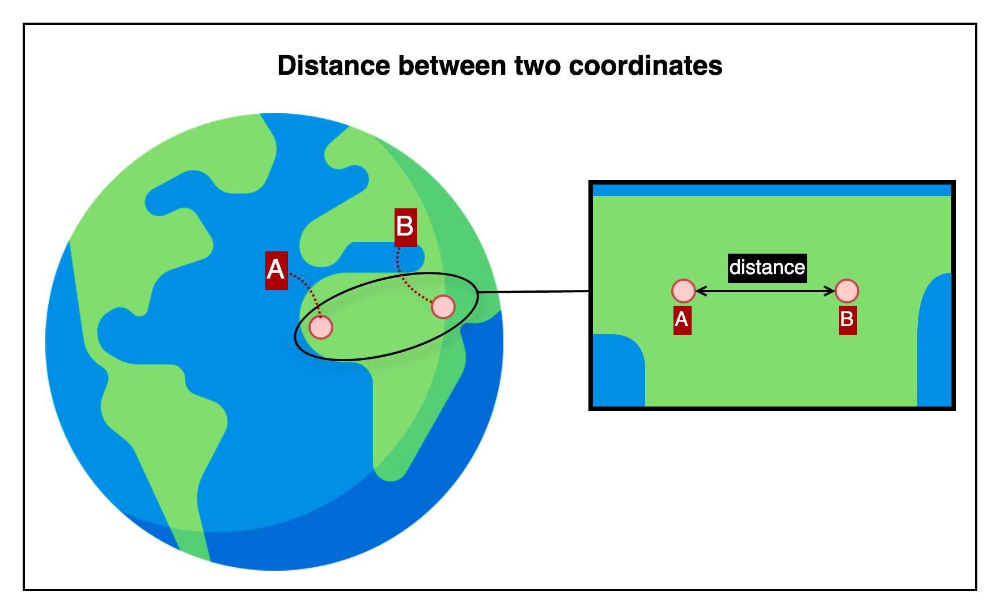

## 📄 Distance between two coordinates API

This is an HTTP API that calculates the straight-line distance between two points based on their latitude and longitude
coordinates.

---

## 👤 Recommended Reading Guide

| Purpose of Use                                   | Start with                                | Description                                                                                       |
|--------------------------------------------------|-------------------------------------------|---------------------------------------------------------------------------------------------------|
| ✅ First-time user                                | [🧭 Overview](#-1-overview)               | Understand what the API does through a visual explanation. Start with the basic concepts.         |
| ✅ Users starting integration development         | [📤 Request Details](#-2-request-details) | Learn the request and response formats to quickly integrate and test the API in your application. |
| ✅ Users who want to test or use the API directly | [🔗 Reference Links](#-5-reference-links) | Test the API in the RapidAPI console and get your API key to start making live calls.             |

---

## 📚 Table of Contents

1. [🧭 Overview](#-1-overview)
2. [📤 Request Details](#-2-request-details)
    1. [Request Example](#-2-1-request-example)
    2. [Request Specifications](#-2-2-request-spec)
3. [📥 Response Details](#-3-response-details)
    1. [Response Example](#-3-1-response-example)
    2. [Response Specifications](#-3-2-response-specifications)
4. [💥 Error Response Examples](#-4-error-response-examples)
5. [🔗 Reference Links](#-5-reference-links)

---

## 🧭 1. Overview



This API calculates and returns the shortest distance between two geographic coordinates (latitude and longitude) on the
Earth's surface.
The default unit for the returned distance is meters, with options to calculate in feet and miles as needed.

---

## 📤 2. Request Details

### 2.1 Request Example

```http request
# Distance Between Two Coordinates API reqeust example
POST {{host}}/distance/between-coordinates?unit=mm
Content-Type: application/json

{
  "fromCoordinate": {
    "lat": 37.61851599854798,
    "lng": 126.92002132129107
  },
  "toCoordinate": {
    "lat": 37.618385433468916,
    "lng": 126.9203394433419
  }
}
```

### 2.2 Request Spec

#### Base Endpoint Info

| **API Provider Platform** | **Method** | **Base URL(HTTP Protocol + Host)** | **Path**                        |
|:-------------------------:|:----------:|------------------------------------|:--------------------------------|
|         Rapid API         |    POST    | `https://yourapi.p.rapidapi.com`   | `/distance/between-coordinates` |

#### Request Headers

| Header Name       | Type   | Required | Description                         |
|-------------------|--------|----------|-------------------------------------|
| `Content-Type`    | string | ✅        | Must be `application/json`          |
| `X-RapidAPI-Key`  | string | ✅        | Your API key issued by RapidAPI     |
| `X-RapidAPI-Host` | string | ✅        | The API host identifier on RapidAPI |

#### Query Parameters

| Parameter | Type   | Required   | Description                                                   |
|-----------|--------|------------|---------------------------------------------------------------|
| `unit`    | string | ❌ Optional | Distance unit (`mm`, `m`, `km`, `ft`, `mi`) — defaults to `m` |

#### Request Body

| Field                | Type   | Required | Description                        |
|----------------------|--------|----------|------------------------------------|
| `fromCoordinate.lat` | number | ✅        | Latitude of the starting point     |
| `fromCoordinate.lng` | number | ✅        | Longitude of the starting point    |
| `toCoordinate.lat`   | number | ✅        | Latitude of the destination point  |
| `toCoordinate.lng`   | number | ✅        | Longitude of the destination point |

---

## 📥 3. Response Details

### 3.1 Response Example

```json
{
  "distance": 47.0,
  "unit": "m"
}
```

### 3.2 Response Specifications

| Field           | Type    | Nullable | Description                                        |
|-----------------|---------|----------|----------------------------------------------------|
| `success`       | boolean | ❌        | Indicates whether the operation succeeded          |
| `data`          | object  | ❌        | Included only when `success` is `true`             |
| `data.distance` | number  | ❌        | Distance between coordinates (4 decimal precision) |
| `data.unit`     | string  | ❌        | Unit of measurement (e.g. `m`, `km`, `mi`)         |

| Field           | Type    | Description                                                |
|-----------------|---------|------------------------------------------------------------|
| `success`       | boolean | Indicates whether the operation succeeded                  |
| `data`          | object  | Contains the result of the calculation                     |
| `data.distance` | number  | Distance between coordinates (precision: 4 decimal places) |
| `data.unit`     | string  | Unit of measurement used in the response                   |

---

## 💥 4. Error Response Examples

```json
{
  "success": false,
  "error": {
    "code": 400,
    "message": "Invalid input: 'lat' and 'lng' are required."
  }
}
```

| Field           | Type    | Description                         |
|-----------------|---------|-------------------------------------|
| `success`       | boolean | Always `false` when an error occurs |
| `error.code`    | number  | HTTP status code                    |
| `error.message` | string  | Description of the error            |

---

## 🔗 5. Reference Links

---

[Go to API List](../index.md)